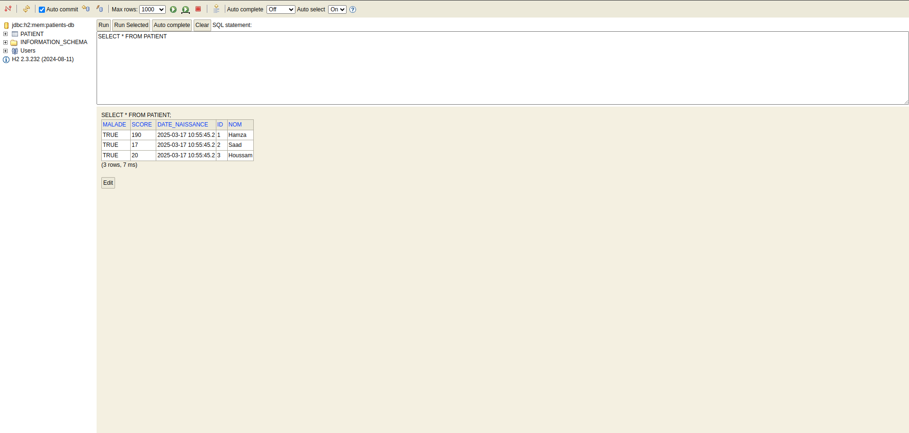

# JEE-Spring-MVC-TP3-Hospital

### Création de l'entité et configuration JPA
* Définition de l'entité Patient

* L'ajout des annotations JPA (@Entity, @Data, @NoArgsConstructor, @AllArgsConstructor, @Builder).
Configuration de JPA et H2

* Configurez la base de données H2 dans le fichier application.yml en spécifiant l'URL.

Accédez à la console H2 via l'URL fournie : http://localhost:8080/h2-console

